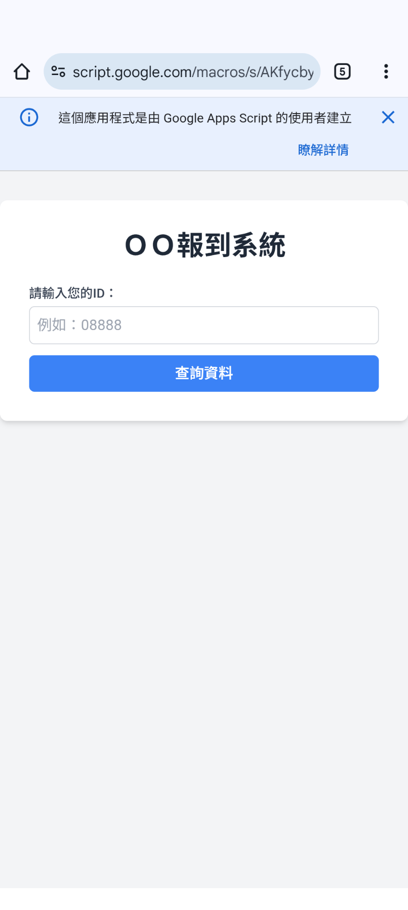
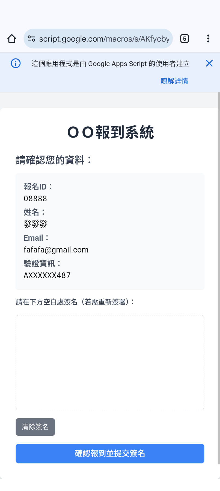
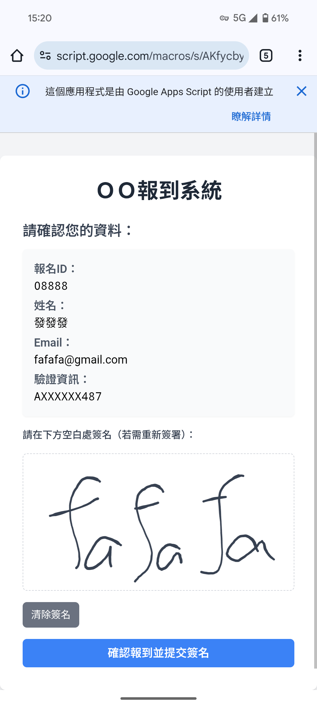
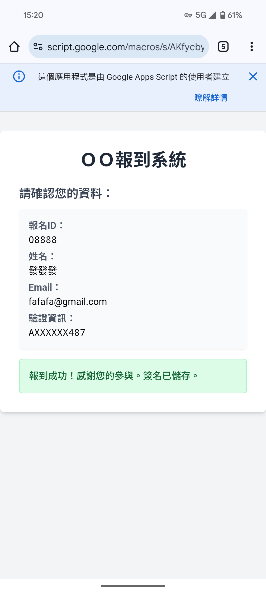
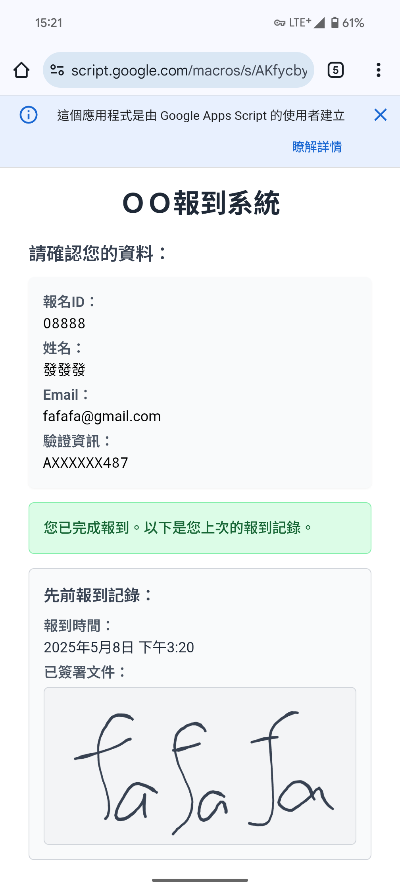

# 活動報到系統

此專案是一個基於 Google Apps Script 的活動報到系統，提供參與者查詢報名資料、簽名報到並儲存簽名至 Google Drive 的功能。

## 功能介紹

1. **查詢報名資料**：使用者輸入報名 ID 後，系統會從 Google 試算表中查詢對應的參與者資料。

| 查詢報名首頁      | 查詢報名資料 |
|:------------------:|:------------------:|
| |  |

2. **簽名報到**：參與者可在簽名區簽名，並提交報到資料。

  

3. **儲存簽名**：簽名圖片會以檔案形式儲存至 Google Drive，並將檔案 URL 回寫至試算表。

  

4. **顯示先前簽名**：若參與者已完成報到，又重複進入，系統會顯示先前的簽名記錄。

  

## 試算表欄位說明

以下是系統使用的 Google 試算表欄位：

| 欄位名稱             | 說明                       |
|----------------------|----------------------------|
| `id`                | 報名 ID，參與者的唯一識別碼 |
| `name`              | 參與者姓名                 |
| `email`             | 參與者電子郵件             |
| `idNumber`          | 身分證字號（遮罩處理後顯示）|
| `checkInStatus`     | 報到狀態（例如：`已報到`）  |
| `signatureTimestamp`| 簽名時間戳                 |
| `signatureFileUrl`  | 簽名圖片的 Google Drive URL |
| `signature`         | 簽名圖片（試算表內嵌圖片） |

## 系統架構

### 前端
- 使用 HTML、CSS（Tailwind CSS）和 JavaScript 實現。
- 使用 [SignaturePad](https://github.com/szimek/signature_pad) 提供簽名功能。
- 前端程式碼直接嵌入 Google Apps Script 的 HTML 檔案中。

### 後端
- 使用 Google Apps Script 實現，與 Google 試算表和 Google Drive 整合。

### 資料流程
1. 使用者輸入報名 ID，系統查詢試算表資料。
2. 若資料存在且尚未報到，顯示簽名區。
3. 使用者簽名並提交後，系統將簽名圖片儲存至 Google Drive，並更新試算表資料。

## 安裝與部署

1. **建立 Google 試算表**：
   - 建立一個試算表，並新增以下欄位：`id`, `name`, `email`, `idNumber`, `checkInStatus`, `signatureTimestamp`, `signatureFileUrl`, `signature`。
   - 記下試算表的 ID。

2. **建立 Google Drive 資料夾**：
   - 登入 Google Drive，建立一個資料夾作為簽名圖片的存放目標。
   - 右鍵點擊資料夾，選擇「取得連結」，將資料夾的權限設為「任何知道連結的人都可以檢視」。
   - 記下該資料夾的 ID（資料夾 URL 中 `/folders/` 後的部分）。

3. **設定 Google Apps Script**：
   - 開啟 Apps Script 編輯器，新增專案。
   - 將後端程式碼貼上至 `.gs` 檔案。
   - 將前端程式碼貼上至 `.html` 檔案。
   - 在程式碼中設定試算表 ID 和 Google Drive 資料夾 ID。

4. **部署 Web App**：
   - 在 Apps Script 編輯器中，點擊 `部署 > 新部署`。
   - 選擇 `Web 應用程式`，設定版本並部署。
   - 記下 Web App 的 URL。

## 使用方式

1. 開啟 Web App，輸入報名 ID 查詢資料。
2. 確認資料後，於簽名區簽名並提交。
3. 系統會顯示報到成功訊息，並更新試算表資料。

## 注意事項

- 確保 Google 試算表和 Google Drive 資料夾的權限正確設定，允許 Apps Script 存取。
- 若試算表欄位名稱有變更，需同步更新程式碼中的欄位名稱。

## 開發工具

- **Google Apps Script**
- **HTML / CSS / JavaScript**
- **Tailwind CSS**
- **SignaturePad**